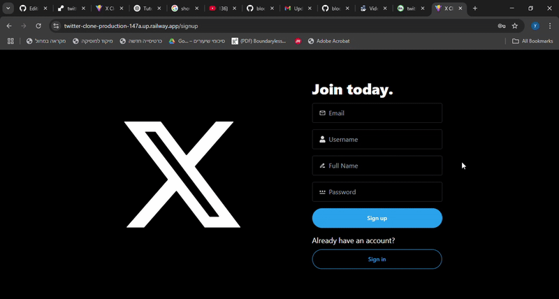

## 📌 Twitter Clone
A full-stack social media application inspired by Twitter, allowing users to post, follow others, like, comment, and upload images. The application is built using Node.js for the backend and React.js for the frontend, providing a real-time, dynamic social experience.

## 📺 Demo



## 🚀 Features
📝 Users can create posts, like posts, comment, and follow other users.

🖼️ Image upload functionality with Cloudinary integration for storing images.

🔐 Authentication with secure, HTTP-only cookies to maintain user sessions.

💬 Real-time updates with live likes, comments, and follow actions, powered by TanStack Query.

🧑‍💻 User profiles with the ability to update their information and upload profile pictures.

📱 Fully responsive design for a seamless experience across devices.

## 🧑‍💻 Tech Stack

Frontend
- React, Tailwind CSS, daisyUI, Axios, TanStack Query

Backend
- Node.js, Express.js, MongoDB (Mongoose), Bcrypt, cookie-parser, dotenv

Other Tools

- Postman, Cloudinary


### Setup .env file

```js
MONGO_URI=...
PORT=...
JWT_SECRET=...
NODE_ENV=...
CLOUDINARY_CLOUD_NAME=...
CLOUDINARY_API_KEY=...
CLOUDINARY_API_SECRET=...
```

### Build the app

```shell
npm run build
```

### Start the app

```shell
npm start
```

## 🙏 Acknowledgments
This project was built as part of my personal learning path. I want to thank the online developer community and the many tutorials, videos, and blog posts that helped guide and inspire me throughout the process of building this app.

Thanks for checking it out! 🌿
Thanks for checking it out! 🌿
